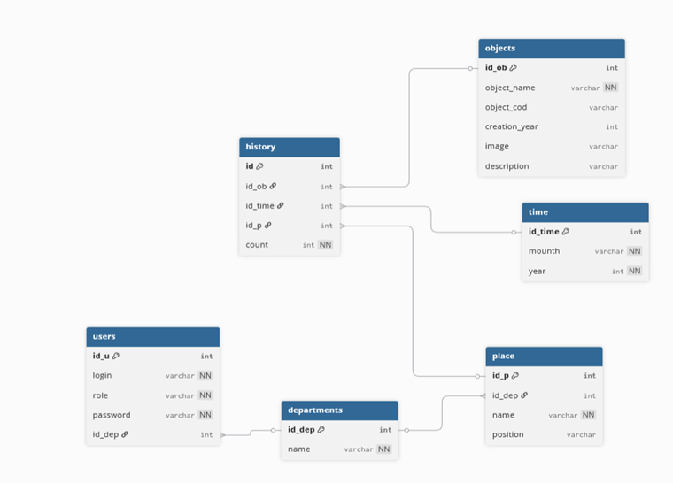

<p align="center">Министерство образования, науки и молодежной политики Республики Коми</p>

<p align="center">ГПОУ "Сыктывкарский политехнический техникум"</p>


<p align="center">Курсовая работа</p>

<p align="center">тема: База Данных для проведения инвентаризации</p>


<p align="right"> выполнил </p>

<p align="right">студент 4 курса </p>

<p align="right">414 группы </p>

<p align="right">Белов Михаил Владимирович</p>


<p align="right">проверил</p>

<p align="right">Пунгин И.В.</p>

<p align="right">дата проверки: ______________</p>


<p align="center">Сыктывкар, 2025</p>

## <a id="content">Содержание</a>

1. [Введение](#introduction)
    - [Цель работы](#target)
    - [Задачи работы](#tasks)
2. [Основная часть](#main)
    - [Анализ предметной области. Постановка задачи](#analysis)
    - [Инфологическая (концептуальная) модель базы данных](#infological_model)
    - [Логическая структура БД](#logical_structure)
    - [Физическая структура базы данных](#physical_structure)
    - [Реализация проекта в среде конкретной СУБД](#project_realization)
3. [Заключение](#conclusion)
4. [Список использованных информационных источников](#literature)
5. [Приложения](#applications)

	


## <a id="introduction">Введение</a>
В современном мире понимание что, в каком количестве, где хранится и используется является ядром не только производственного процесса, но и административного, без этих данных большинство логистических систем просто не смогут функционировать. Всё это обуславливает актуальность разработки базы данных (БД) для проведения инвентаризации. Эта система должна обеспечивать удобный доступ к информации как для ответственных за проведение инвентаризации людей, по каждому отделу, включая данные об объектах, находящихся во владении организации, их расположения, а также информация о том, кто проводил инвентаризацию и/или изменял данные в БД.

Внедрение базы данных позволит ускорить процесс проведения инвентаризации, а также дать возможность быстро узнать, где находиться искомый предмет, сократив время на выполнение задачи и снизив вероятность ошибок. Ключевой задачей разработки БД является создание интуитивно понятного интерфейса для ввода, редактирования данных и генерации отчетов. Система должна обрабатывать запросы различной сложности и обеспечивать безопасность данных, включая механизмы защиты от несанкционированного доступа.

Реализация данного проекта создаст эффективную систему, способную хранить и анализировать данные, что позволит организациям уменьшить нагрузку и ускорить процесс при выполнении пересчёта собственности, а ещё повысить точность данных о хранимых объектах. Таким образом, курсовая работа направлена на разработку базы данных для проведения инвентаризации, отвечающей современным требованиям и способствующей оптимизации работы компаний.


#### <a id="target">Цель работы</a>
Целью данной курсовой работы является разработка базы данных для проведения инвентаризации, которая позволит эффективно создавать и управлять информацией о хранимых объектах и их местоположении, а также обеспечить доступ к этой информации для различных пользователей. В рамках работы предполагается несколько этапов:
1.	**Создание структуры базы данных:** Разработать схему базы данных, произвести анализ и уточнение структуры, чтобы обеспечить целостность и согласованность данных. Важно, чтобы каждая таблица адекватно отражала сущности предметной области и их взаимосвязи.
2.	**Реализация функционала для ввода и обновления данных:** Разработка функций для добавления и изменения информации об объектах и управления данными о помещениях, пользователях, а также хранение информации о том, кто и когда изменял и добавлял данные. Это позволит пользователям (администраторам, ответственных за инвентаризацию и начальникам отделов) легко вводить и искать данные, обновлять существующие записи и поддерживать актуальность и безопасность хранимой информации.
3.	**Создание представлений и запросов для отображения хранимой информации:** Реализация представлений, которые будут отображать что и в каком количестве храниться в выбранной комнате. Это позволит пользователям быстро получать информацию о текущем расположении вещей, что будет удобно для как для замены поломанных деталей, так и для организации работы для новых сотрудников.
4.	**Обеспечение безопасности и управления доступом:** Разработка системы прав доступа, которая будет ограничивать возможности пользователей в зависимости от их ролей (администратор, ответственные отделов). Это необходимо для защиты конфиденциальной информации о логистики и обеспечения целостности данных.
5.	**Анализ полученных данных:** Проведение анализа тенденций изменений после каждой инвентаризации с использованием созданной базы данных. Это позволит выявить, что нужно закупить в организацию, а что находиться в излишках для анализа работы предприятия и принятия решений по дальнейшей работы организации.
6.	**Документирование процесса разработки:** Подготовка технической и эксплуатационной документации, включая описание структуры базы данных, функционала, а также руководства для пользователей. Это обеспечит удобство в использовании системы и поможет в обучении новых пользователей.
Таким образом, цель работы заключается в создании эффективной базы данных для проведения инвентаризации, которая будет способствовать оптимизации процессов по управлению материальной собственности организации.

#### <a id="tasks">Задачи работы</a>
Для достижения поставленной цели необходимо решить следующие задачи:
1.	**Анализировать предметную область инвентаризации.** Это включает в себя изучение существующих методов проведения учета собственности организаций, требования пользователей (администратор, ответственные отделов), а также особенностей работы выбранного предприятия. Необходимо определить, какую информацию нужно хранить и обрабатывать, и выявить ключевые проблемы, которые могут быть решены с помощью базы данных.
2.	**Проектировать структуру базы данных.** На этом этапе необходимо определить ключевые таблицы, их атрибуты и связи между сущностями. В частности, следует четко определить структуру таблиц. Важно установить правильные типы данных для каждого атрибута и определить, какие ограничения целостности должны быть применены (например: уникальность).
3.	**Выбрать и обосновать систему управления базами данных (СУБД).** Необходимо провести анализ различных СУБД (например, MySQL, PostgreSQL, SQLite) с учетом требований проекта, таких как производительность, масштабируемость, простота использования и поддержка необходимых функций. На основании этого анализа следует выбрать наиболее подходящую СУБД и обосновать выбор.
4.	**Реализовать структуру базы данных на выбранной СУБД.** Это включает в себя написание SQL-запросов для создания таблиц, определения их атрибутов и установления связей между ними. Необходимо учесть создание индексов для оптимизации запросов и обеспечения быстрого доступа к данным.
5.	**Заполнить базу данных тестовыми данными.** Для проверки работоспособности и корректности структуры базы данных необходимо подготовить и вставить тестовые данные в каждую из таблиц. Это позволит убедиться в правильности работы системы и обеспечит возможность тестирования различных функций и запросов.
6.	**Осуществить тестирование базы данных.** На этом этапе необходимо провести комплексное тестирование, чтобы проверить корректность выполнения всех операций, целостность данных и функциональность запросов. Это может включать в себя как ручное тестирование, так и автоматизированные тесты для проверки различных сценариев использования базы данных.
7.	**Сформулировать выводы и предложения по дальнейшему развитию и расширению функционала базы данных.** На основе полученных результатов тестирования и анализа работы системы следует сделать выводы о её эффективности, выявить возможные недостатки и предложить пути их устранения. Это может включать в себя рекомендации по улучшению интерфейса, добавлению новых функций или оптимизации структуры базы данных.
Эти задачи направлены на создание эффективного инструмента, который позволит предприятиям хранить данные в упорядоченном виде, автоматизировать ключевые процессы учета и анализа, а также облегчить поиск информации для всех пользователей.


## <a id="main">Основная часть</a>

#### <a id="analysis">Анализ предметной области. Постановка задачи</a>
1.	**Описание предметной области и функции решаемых задач**
  - **Предметная область данной работы** - управление материальной собственности в различных организациях. Система направлена на автоматизацию процессов учета объектов, что позволит сотрудникам быстро искать, считать и отслеживать перемещения предметов на предприятии. Основной целью автоматизации является упрощение работы с данными, надежное хранение данных и повышение прозрачности информации.
  - **Функции решаемых задач:**
    - **Хранение информации об объектах:** Ведение базы данных, содержащей информацию о каждом объекте (название, код, год изготовления, картинка, краткое описание). Это позволит администраторам легко управлять данными о предметах и отслеживать их изменения.
    - **Ведение записи расположения объектов:** Запись количества объектов как в определенном помещении, так и во всей организации с указанием месяца последнего учета, количества объекта и его расположения. Это позволит сформировать полную картину материальной собственности организации по её отделам и анализировать динамику изменений со временем.
    - **Обеспечение доступа к информации:** Создание интуитивно понятного интерфейса, который позволит ответственным за инвентаризацию легко находить и вводить нужные данные о объектах на месте.
2.	**Перечень входных данных. Для эффективной работы системы необходимы следующие входные данные:**
  - **Данные об отделах:**
    - Идентификатор отдела (ID)
    - Название отдела;
  - **Данные о помещениях:**
    - Идентификатор помещения
    - Название помещения
    - Отдел, к которому принадлежит помещение;
    - Расположение помещения
  **Данные о времени:**
    - Идентификатор времени (ID);
    - Дата;
  - **Данные о пользователях:**
    - Идентификатор пользователя (ID);
    - Логин пользователя;
    - Роль пользователя;
    - Пароль для входа в систему;
    - Департамент, за который ответственен пользователь;
  - **Данные об объектах:**
    - Идентификатор объекта (ID);
    - Название объекта;
    - Код объекта;
    - Год создания;
    - Картинка объекта;
    - Описание объекта;
  - **Данные о журнале инвентаризации:**
    - Идентификатор (ID);
    - Название объекта;
    - Время, когда его последний раз здесь видели;
    - Помещение, где находиться объект;
    - Количество объектов;


3.	**Перечень выходных данных.** На основе входных данных система должна предоставить следующие выходные данные:
  - **Отчёт по инвентаризации:**
    -	Материальная собственность организации за, проведенную инвентаризацию.
  - **Сравнительная статистика по проведенным инвентаризациям:**
    -	Сравнение данных за текущую и предыдущую инвентаризацию.
  - **Информация о хранимых объектах и помещениях:**
    -	Список хранимых предметов в организации.
    -	Список помещений в организации.
4.	Ограничения предметной области. При работе с базой данных могут возникнуть следующие ограничения:
  - **Ограничение по объёму данных:** Увеличение количества отделов, а также количество, проведённых инвентаризаций может негативно сказаться на производительности системы. Необходимо учитывать возможность оптимизации базы данных, включая использование индексации и других методов для повышения скорости обработки запросов.
  - **Ограничение по доступу:** ввод, изменение и удаление информации в отдел пользователем, за который он не ответственен, должен быть невозможен. Это требует реализации надежных механизмов авторизации, чтобы только уполномоченные лица могли изменять доступные им данные.
  - **Ограничение по обновлению данных:** для предотвращения потери данных необходимо разработать систему резервного копирования. Регулярные бэкапы помогут избежать потерь информации в случае технических сбоев или ошибок пользователей.
5.	Взаимодействие с другими программами. Система инвентаризации сможет взаимодействовать с различными административными, финансовыми и аналитическими системами для расширения функциональности:
  - **Система аналитики:** Интеграция с аналитическими платформами (например, Power BI или Google Data Studio) для визуализации данных и создания отчетов, что поможет в анализе хранимой информации и выявлении проблемных областей.


#### <a id="infological_model">Инфологическая (концептуальная) модель базы данных</a>
Концептуальная модель базы данных описывает структуру данных, которая будет храниться и обрабатываться в базе, без привязки к конкретной системе управления базами данных (СУБД). В рамках этой модели выделяются ключевые информационные объекты, атрибуты этих объектов, связи между ними, а также мощности отношений, которые определяют тип связей между сущностями.
1.	Выделение информационных объектов.
  - **Отделы** - информация о в организации.
  - **Помещения** - данные помещениях.
  - **Пользователи** - данные о пользователях БД.
  - **Время** – данные о времени.
  - **Объекты** - данные о хранимых объектах.
  - **Журнал инвентаризации** – информация о последней проведенное инвентаризации, а также о текущем расположении объектов
2.	Определение атрибутов объектов. Каждая из выделенных сущностей имеют свои уникальные атрибуты, которые описывают их свойства.
  - **Отделы:**
    -	id_dep (Уникальный идентификатор отдела).
    -	name (Название отдела).
  - **Помещения:**
    -	id_p (Уникальный идентификатор помещения).
    -	id_dep (Идентификатор отдела, к которому относится помещение).
    -	name (Название помещения/склада).
    -	position (Точное расположение внутри помещения, например, полка или сектор).
  - **Пользователи:**
    -	id_u (Уникальный идентификатор пользователя).
    -	login (Логин для авторизации в системе).
    -	role (Роль пользователя в системе, например, администратор или сотрудник).
    -	password (Пароль для авторизации).
    -	id_dep (Идентификатор отдела, за который отвечает пользователь).
  - **Объекты:**
    -	id_ob (Уникальный идентификатор объекта).
    -	object_name (Наименование инвентарного объекта).
    -	object_cod (Уникальный инвентарный номер/код объекта).
    -	creation_year (Год создания или приобретения объекта).
    -	IMAGE (Ссылка или путь к изображению объекта).
    -	description (Дополнительное описание объекта).
  - **Время:**
    -	id_time (Уникальный идентификатор временной метки).
    -	day (Определённый день в году)
  - **Журнал инвентаризации:**
    -	id (Уникальный идентификатор журанала).
    -	id_ob (Идентификатор объекта).
    -	id_time (Идентификатор временного периода).
    -	id_p (Идентификатор помещения, где находится объект).
    -	count (Количество единиц объекта в данном месте в данное время).


3.	Определение отношений и мощности отношений между объектами. В данной базе данных для проведенной инвентаризации выделены следующие сущности и их взаимосвязи:
  - **Отдел — Помещение:**
    -	Связь: один ко многим.
    -	Описание: Один отдел может включать в себя множество помещений, однако каждое конкретное помещение закреплено только за одним отделом. Это позволяет четко разграничить зоны ответственности и организовать структуру хранения имущества в рамках организации.
  - **Отдел — Пользователь:**
    -	Связь: один ко многим.
    -	Описание: В одном отделе может работать множество пользователей (сотрудников), но каждый пользователь (кроме администраторов) приписан к одному конкретному отделу. Это отношение необходимо для реализации политики безопасности, ограничивая права доступа на изменения сотруднику только инвентарем его отдела.
  - **Объект — Журнал инвентаризации:**
    -	Связь: один ко многим.
    -	Описание: Один уникальный объект может иметь множество записей в таблице «Журнал инвентаризации», отражающих его расположение, количества в разные периоды инвентаризации.
  - **Помещение — Журнал инвентаризации:**
    -	Связь: один ко многим.
    -	Описание: Одно помещение может фигурировать во множестве записей истории, так как в нем могут храниться разные объекты в разное время.
  - **Время — Журнал инвентаризации:**
    -	Связь: один ко многим.
    -	Описание: Один временной период может быть связан с множеством записей в журнале инвентаризации. Каждая запись относится к одной временной метке, что позволяет группировать данные и формировать отчеты по итогам отчетных периодов.
Каждое из этих отношений помогает структурировать данные в базе и обеспечивает возможность глубокого анализа объектов внутри организации.


4.	Построение концептуальной модели. На основе выделенных сущностей, их атрибутов и связей между ними можно построить концептуальную ER-диаграмму для базы данных, предназначенной для проведения инвентаризации.


 


Эта концептуальная модель позволяет наглядно представить структуру базы данных, а также связи между различными сущностями, что упрощает дальнейшее проектирование и реализацию системы для проведения инвентаризации.


#### <a id="logical_structure">Логическая структура базы данных</a>
Логическая структура базы данных представляет собой детализированное описание таблиц, их атрибутов, типов данных, а также ключевых ограничений и правил целостности. На основе концептуальной модели можно построить логическую структуру, которая будет готова для реализации в системе управления базами данных (СУБД).
В данной структуре будут определены следующие таблицы: Отделы, Помещения, Объекты, Время, Журнал инвентаризации, Пользователи, а также связи между ними.
#### Определение таблиц и их атрибутов
1.	**Таблица Отделы:**
    -	id_dep (Primary Key) — уникальный идентификатор отдела (целое число).
    -	name — название отдела (строка).
      
  - **Типы данных:**
    -	id_dep — SERIAL.
    -	name — VARCHAR.
    
  - **Ограничения:**
    -	id_dep является уникальным и не может быть NULL.
    -	name является уникальным и не может быть NULL.
2.	**Таблица Помещения**
    -	id_p (Primary Key) — уникальный идентификатор помещения (целое число).
    -	id_dep (Foreign Key) — ссылка на таблицу Отделы (целое число).
    -	name — название помещения (строка).
    -	position — точное расположение/позиция (строка).
    
  - **Типы данных:**
    -	id_p — SERIAL.
    -	id_dep — INT4.
    -	name — VARCHAR.
    -	position — VARCHAR.
      
  - **Ограничения:**
    -	id_p является уникальным и не может быть NULL.
    -	id_dep является внешним ключом, ссылается на таблицу Отделы и не может быть NULL.
    -	name и position не могут быть NULL.
      
3.	 **Таблица Объекты**
    -	id_ob (Primary Key) — уникальный идентификатор объекта (целое число).
    -	object_name — наименование объекта (строка).
    -	object_cod — уникальный инвентарный код (строка).
    -	creation_year — год создания/производства (целое число).
    -	IMAGE — путь к изображению (строка).
    -	description — описание объекта (строка).
  	
  - **Типы данных:**
    -	id_ob — SERIAL.
    -	object_name — VARCHAR.
    -	object_cod — VARCHAR.
    -	creation_year — INT4.
    -	IMAGE — VARCHAR.
    -	description — VARCHAR.
      
  - **Ограничения:**
    -	id_ob является уникальным и не может быть NULL.
    -	object_name не может быть NULL.
    -	object_cod является уникальным и не может быть NULL.
      
4.	**Таблица Время**
    -	id_time (Primary Key) — уникальный идентификатор временной записи (целое число).
    -	day - дата (день, месяц, год)
      
  - **Типы данных:**
    -	id_time — SERIAL.
    -	day - DATE.
      
  - **Ограничения:**
    -	id_time является уникальным и не может быть NULL.
    -	mounth и year не могут быть NULL.
      
5.	**Таблица Журнал инвентаризации**
    -	id (Primary Key) — уникальный идентификатор записи истории (целое число).
    -	id_ob (Foreign Key) — ссылка на таблицу Объекты (целое число).
    -	id_time (Foreign Key) — ссылка на таблицу Время (целое число).
    -	id_p (Foreign Key) — ссылка на таблицу Помещения (целое число).
    -	count — количество объектов (целое число).
      
  - **Типы данных:**
    -	id — SERIAL.
    -	id_ob — INT4.
    -	id_time — INT4.
    -	id_p — INT4.
    -	count — INT4.
      
  - **Ограничения:**
    -	id является уникальным и не может быть NULL.
    -	id_ob, id_time и id_p являются внешними ключами, ссылающимися на соответствующие таблицы.
    -	count не может быть NULL.
      
6.	**Таблица Пользователи**
    -	id_u (Primary Key) — уникальный идентификатор пользователя (целое число).
    -	login — логин для входа (строка).
    -	role — роль пользователя (строка).
    -	password — пароль (строка).
    -	id_dep (Foreign Key) — ссылка на таблицу Отделы (целое число).
      
  - **Типы данных:**
    -	id_u — SERIAL.
    -	login — VARCHAR(50).
    -	role — VARCHAR(50).
    -	password — VARCHAR(50).
    -	id_dep — INT4.
      
  - **Ограничения:**
    -	id_u является уникальным и не может быть NULL.
    -	login и password не могут быть NULL.
    -	id_dep является внешним ключом, ссылающимся на таблицу Отделы.
      
Нормализация базы данных
На данном этапе структура базы данных приведена к третьей нормальной форме (3NF), что позволяет:
	-   Устранить избыточность данных.
	-	Избежать аномалий при добавлении, изменении и удалении данных.
	-	Обеспечить более эффективное использование памяти и более быструю обработку запросов.

## <a id="physical_structure">Физическая структура базы данных</a>


Физический уровень базы данных отвечает за непосредственное хранение данных и способы манипулирования ими, гарантируя сохранность информации и скорость работы системы. На данном этапе проектирования решаются задачи оптимизации производительности с учетом специфики физического хранения и прогнозируемых объемов данных.
Для реализации проекта используется СУБД PostgreSQL, так как ее функционал идеально подходит для работы со сложными связями и структурированными табличными данными, характерными для образовательных учреждений.


Основная задача при построении физической структуры — обеспечить оперативный доступ пользователей к информации. Высокая скорость обработки запросов и надежность системы достигаются за счет грамотного использования индексов, корректного определения типов данных и тонкой настройки параметров хранения внутри СУБД.

1. **Выбор типов данных**

Правильный выбор типов данных для полей таблиц — один из ключевых аспектов проектирования физической структуры базы данных, так как это позволяет экономить ресурсы и повышать производительность.

Рассмотрим выбор типов данных для каждой таблицы:

-	SERIAL4 — используется для автоинкрементных значений, таких как идентификаторы записей. Это подходит для полей, которые используются как ключи и часто участвуют в соединениях и фильтрации данных.
-	INT4 — используется для целочисленных значений, занимает фиксированный объем памяти и обеспечивает эффективное индексирование, что важно для первичных и внешних ключей. Это подходит для полей, которые используются как ключи и часто участвуют в соединениях и фильтрации данных.
-	VARCHAR(n) — применяется для хранения текстовых данных переменной длины, таких как имена, названия, описания и пароли. Этот тип позволяет оптимально расходовать память, так как фактически занимает объем, соответствующий реальной длине строки.
-	DATE — этот тип данных используется для хранения дат. Он позволяет хранить значения в формате даты (год, месяц, день) и обеспечивает удобные функции для работы с датами, такие как сравнение и вычисление разницы между датами.
Тип данных влияет на объем занимаемой памяти и производительность базы данных, так как данные записываются и извлекаются в зависимости от того, какой тип используется.
**Пример SQL-кода с применением типов данных для таблицы " Inventory_Log":**
```
CREATE TABLE Inventory_Log
(id serial4 PRIMARY KEY,
id_ob INT4 NOT NULL,
id_time INT4 NOT NULL,
id_p INT4 NOT NULL,
count INT4 NOT NULL,
FOREIGN KEY (id_ob) REFERENCES objects (id_ob),
FOREIGN KEY (id_time) REFERENCES time (id_time),
FOREIGN KEY (id_p) REFERENCES place (id_p));
```
2.	**Оптимизация индексов**
Индексы являются ключевым элементом в оптимизации базы данных, так как они позволяют ускорить доступ к данным и облегчают выполнение запросов, таких как поиск, фильтрация и сортировка. Индексы создаются для полей, которые часто участвуют в поисковых запросах и соединениях таблиц.
- Первичные ключи автоматически индексируются, так как они служат для уникальной идентификации каждой записи. Это гарантирует быстрое выполнение операций поиска и обновления записей.
- Внешние ключи (например, student_id, class_id, subject_id, teacher_id) также индексируются, чтобы ускорить выполнение соединений между таблицами. Внешние ключи позволяют поддерживать целостность данных, предотвращая создание записей, не соответствующих связанным данным.
- Дополнительные индексы — могут быть добавлены для часто запрашиваемых полей, например, для поля lesson_date в таблице Оценки, если предполагается, что пользователи часто будут искать оценки по дате.
- **Преимущества индексов:**
	- Ускоряют поиск и сортировку.
	- Повышают производительность запросов с условиями фильтрации.
	- Уменьшают время выполнения операций соединения.
- **Недостаток индексов:**
	-Индексы занимают место и могут замедлить операции вставки, обновления и удаления, так как индексы также нужно обновлять.

3.	 **Кластеризация данных и организация таблиц**
Кластеризация представляет собой метод физической организации данных на дисковом пространстве, при котором строки таблицы упорядочиваются в соответствии с определенным индексом. Это позволяет существенно повысить производительность операций чтения, особенно при выполнении запросов на выборку диапазонов данных.
В контексте разрабатываемой системы, целесообразно применить кластеризацию к таблице Inventory_Log по полю id_time. Это обеспечит физическое соседство записей, относящихся к одному временному периоду, что значительно ускорит формирование отчетов по инвентаризации за конкретные месяцы или дни.

4.	 **Архитектура хранения и оптимизация процессов**
СУБД PostgreSQL базируется на механизме многоверсионного управления конкурентным доступом (MVCC — Multiversion Concurrency Control). В отличие от некоторых других систем (например, MySQL), где требуется выбор движка хранения, PostgreSQL не требует явного указания механизма хранения при создании таблиц, потому что все таблицы автоматически используют встроенный механизм. Этот механизм обеспечивает высокий уровень надежности, особенно для данных, подверженных большому количеству изменений, и поддерживает управление транзакциями, что критично для точности и согласованности данных.
**Преимущества MVCC в PostgreSQL для базы данных:**

- Поддержка транзакций — гарантирует согласованность данных. Каждая транзакция выполняется как отдельная операция, и в случае неудачи все изменения отменяются.
- Конкурентный доступ — PostgreSQL позволяет нескольким пользователям одновременно работать с данными, обеспечивая при этом изоляцию транзакций, что делает его особенно подходящим для высоконагруженных приложений, где требуется частое обновление данных.
- Гибкое управление блокировками — позволяет предотвращать конфликты между транзакциями и поддерживает высокую производительность.
		
Особенности PostgreSQL при создании таблиц:
	- **Тип SERIAL:** применяется для автоматической генерации уникальных идентификаторов (id_ob, id_p, id_u). Это упрощает администрирование первичных ключей и гарантирует их уникальность без дополнительных настроек.
	- **CHECK-ограничения:** позволяют задать логические правила для данных на уровне СУБД. Например, существующее правило запрещающее отрицательные значения в поле count (количество объектов) в таблице Inventory_Log.
	
5.	**Политика обеспечения целостности данных**
PostgreSQL предоставляет комплексный набор инструментов для гарантии согласованности и достоверности хранимой информации. Использование декларативных ограничений позволяет перенести логику проверки данных с уровня приложения на уровень базы данных, что повышает надежность системы.

**Используемые механизмы:**
- **Первичные ключи (PRIMARY KEY):** гарантируют уникальность каждой записи. Например, id_ob однозначно идентифицирует каждый объект инвентаря, исключая возможность дублирования оборудования в базе.
- **Внешние ключи (FOREIGN KEY):** обеспечивают ссылочную целостность. Этот механизм не позволит добавить запись в таблицу Inventory_Log, ссылающуюся на несуществующий объект или удаленное помещение. Например, поле id_dep в таблице place сильно привязывает помещение к существующему отделу.
- **Ограничение NOT NULL:** предотвращает внесение неполных данных. Критически важные поля, такие как login пользователя или object_name (название объекта), обязательны для заполнения.
- **Ограничение CHECK:** обеспечивает валидацию данных по заданным критериям.


```
CREATE TABLE Inventory_Log
(id serial4 PRIMARY KEY,
id_ob INT4 NOT NULL,
id_time INT4 NOT NULL,
id_p INT4 NOT NULL,
count INT4 NOT NULL CHECK (count >= 0),
FOREIGN KEY (id_ob) REFERENCES objects (id_ob),
FOREIGN KEY (id_time) REFERENCES time (id_time),
FOREIGN KEY (id_p) REFERENCES place (id_p));
````	
В этом примере используется регулярное выражение для проверки, что количество хранимого объекта не отрицательно, что невозможно физически в реальности.
**Другие механизмы управления целостностью:**

- **Триггеры** — PostgreSQL поддерживает триггеры, которые позволяют выполнять дополнительные проверки и операции при добавлении, обновлении или удалении записей. Триггеры могут использоваться для автоматической записи истории изменений или для сложных проверок целостности, когда стандартных ограничений недостаточно.
- **Индексы** — PostgreSQL автоматически создает индексы для полей, которые заданы как первичные ключи или уникальные. Это улучшает производительность запросов, так как индекс ускоряет поиск и доступ к данным.
- **Управление транзакциями** — PostgreSQL поддерживает уровни изоляции транзакций, которые позволяют определять правила работы с параллельными запросами.

Таким образом, механизмы управления целостностью в PostgreSQL обеспечивают надежную работу базы данных, поддерживая высокую степень согласованности и производительности.

6.	**Параметры хранения и резервное копирование.**
Критически важным аспектом проектирования физической структуры базы данных является обеспечение сохранности данных и минимизация рисков их потери. Для этого необходимо внедрение надежной политики резервного копирования. СУБД PostgreSQL предоставляет гибкие инструменты для реализации как логического, так и физического бэкапа.
Типы резервного копирования:
	- **Логическое резервное копирование.** Осуществляется посредством утилиты pg_dump. Метод заключается в выгрузке структуры базы данных и самих данных в виде SQL-команд или архивного файла. Это решение обеспечивает высокую мобильность данных, позволяя восстанавливать их на серверах с другой архитектурой или обновленной версией СУБД.
Пример команды для создания архива:
```
pg_dump -U username -F c -b -v -f "inventory_backup.dump" inventory_db
```
Данная команда создает сжатый архив, пригодный для последующего восстановления утилитой pg_restore.
	- **Физическое резервное копирование.** Реализуется с помощью инструмента pg_basebackup. Процесс подразумевает побитовое копирование файлов базы данных с диска. Этот метод оптимален для крупных баз данных, так как позволяет значительно сократить время восстановления системы (RTO) и гарантирует полную идентичность данных на момент начала копирования.

Пример команды для создания полной копии:
```
pg_basebackup -U postgres -D /var/lib/postgresql/backup -Ft -z -P
```
В результате создается полный клон каталога данных, что особенно эффективно для развертывания репликации или быстрого восстановления после сбоев оборудования.


7.	**SQL-код создания таблиц с физической структурой для PostgreSQL**
В этом разделе приводится полный пример SQL-кода для создания таблиц, описанных в предыдущих разделах. Каждая таблица строится с учетом требований физической структуры базы данных и с использованием механизмов PostgreSQL для оптимизации, поддержки целостности и обеспечения надежности данных.
```
-- Создание таблицы Департаменты
CREATE TABLE departments 
(id_dep serial4 PRIMARY KEY,
name varchar UNIQUE NOT NULL);
 -- Создание таблицы Места
CREATE TABLE place
(id_p SERIAL4 PRIMARY KEY,
id_dep INT4 NOT NULL,
name VARCHAR (50) NOT NULL,
position VARCHAR (50) NOT NULL,
FOREIGN KEY (id_dep) REFERENCES depertaments (id_dep));

-- Создание таблицы Объекты
CREATE TABLE objects
(id_ob SERIAL4 PRIMARY KEY,
object_name VARCHAR (50) NOT NULL,
object_cod UNIQUE VARCHAR (50) NOT NULL,
creation_year INT4,
IMAGE VARCHAR,
description VARCHAR);
-- Создание таблицы Время
CREATE TABLE time
(id_time SERIAL4 PRIMARY KEY,
day DATE NOT NULL);
-- Создание таблицы Журнал инвентаризации
CREATE TABLE Inventory_Log
(id SERIAL4 PRIMARY KEY,
id_ob INT4 NOT NULL,
id_time INT4 NOT NULL,
id_p INT4 NOT NULL,
count INT4 NOT NULL CHECK (count >= 0),
FOREIGN KEY (id_ob) REFERENCES objects (id_ob),
FOREIGN KEY (id_time) REFERENCES time (id_time),
FOREIGN KEY (id_p) REFERENCES place (id_p));

-- Создание таблицы Пользователи
CREATE TABLE users
(id_u SERIAL4 PRIMARY KEY,
login VARCHAR(50) NOT NULL,
role VARCHAR(50) NOT NULL,
password VARCHAR (50) NOT NULL,
id_dep INT4,
FOREIGN KEY (id_dep) REFERENCES depertaments (id_dep));

-- Индексы для оптимизации запросов
CREATE INDEX idx_history_id_ob ON history(id_ob);
CREATE INDEX idx_history_id_p ON history(id_p);
CREATE INDEX idx_history_id_time ON history(id_time);
CREATE INDEX idx_place_id_dep ON place(id_dep);
CREATE INDEX idx_users_id_dep ON users(id_dep);
CREATE INDEX idx_objects_name ON objects(object_name);
CREATE INDEX idx_time_day ON time(day);
```
Описание и обоснование SQL-кода
	- **Создание таблиц:** Каждая таблица создается с использованием типа SERIAL4 для первичного ключа, который обеспечивает автоинкремент и уникальность записи. Поля, содержащие важные текстовые данные, используются с типом VARCHAR, а для целочисленных значений и дат применяется тип INT4 и DATE соответственно.
•	**Ограничения целостности:** В таблицах установлены внешние ключи для обеспечения ссылочной целостности. Так, id_dep в таблице place ссылается на таблицу departments, показывая, что определённое помещение принадлежит только одному отделу.
•	**Индексы:** Добавлены индексы для полей, которые зачастую участвуют в запросах.
•	**CHECK-ограничения:** Дополнительное ограничение установлено на поле count, чтобы защитить базу данных от некорректных значений.
Этот SQL-код и структура таблиц обеспечивают надежную физическую реализацию базы данных в PostgreSQL для проведения инвентаризации. Она удовлетворяет все требованиям целостности, производительности и масштабируемости.


#### <a id="project_realization">Реализация проекта в среде конкретной СУБД</a>

Этот раздел курсовой работы описывает практическую реализацию базы данных в PostgreSQL. Рассматриваются основные этапы — от создания таблиц и запросов до разработки интерфейса, индексов и резервного копирования.
1.	**Создание таблиц и индексов**
```
SQL-код публиковался выше
```
2.	**Создание представлений и функций**
- **Для удобства работы, реализовано представления просмотра журнала инвентаризации, а также просмотра ответственных за комнату/департамент:**
```
CREATE OR REPLACE VIEW v_full_Inventory_Log AS
SELECT 
    h.id AS Inventory_Log_id,
      - **.object_name,
      - **.object_cod,
    p.name AS place_name,
    p.position AS place_position,
    h.count,
      - **.description,
    t.day AS date_record
FROM Inventory_Log h
JOIN objects   - ** ON h.id_ob =   - **.id_ob
JOIN place p ON h.id_p = p.id_p
JOIN time t ON h.id_time = t.id_time;
```
```
CREATE OR REPLACE VIEW v_rooms_responsible AS
SELECT 
    d.name AS department_name,      
    p.name AS room_name,            
    p.position AS room_position,    
    u.login AS responsible_person,  
    u.role AS person_role           
FROM place p
JOIN departments d ON p.id_dep = d.id_dep
LEFT JOIN users u ON d.id_dep = u.id_dep -- LEFT JOIN: 
ORDER BY d.name, p.name;
```
- **Процедура добавления нового помещения**
```
CREATE OR REPLACE PROCEDURE pr_add_place(
    _id_dep int4,
    _name varchar, 
    _position varchar
)
LANGUAGE plpgsql
AS $$
BEGIN
    INSERT INTO place (id_dep, name, position)
    VALUES (_id_dep, _name, _position);
END;
$$;
```
- Процедура добавления нового объекта
```
CREATE OR REPLACE PROCEDURE pr_add_object(
    _object_name varchar,
    _object_cod varchar,
    _creation_year int4,
    _image varchar
)
LANGUAGE plpgsql
AS $$
BEGIN
    INSERT INTO objects (object_name, object_cod, creation_year, IMAGE)
    VALUES (_object_name, _object_cod, _creation_year, _image);
END;
$$;
```
- **Процедура добавления нового пользователя**
```
CREATE OR REPLACE PROCEDURE pr_add_user(
    _login varchar, 
    _password varchar,
    _role varchar,
    _id_dep int4
)
LANGUAGE plpgsql
AS $$
BEGIN
    INSERT INTO users (login, password, role, id_dep)
    VALUES (_login, _password, _role, _id_dep);
   EXCEPTION WHEN unique_violation THEN
   RAISE NOTICE 'Пользователь с логином % уже существует.', _login;
END;
$$;
```
- **Процедура добавления в журнал инвентаризации**
```
CREATE OR REPLACE PROCEDURE pr_add_Inventory_Log(
    _id_ob int4,
    _id_time int4, 
    _id_p int4,
    _count int4
)
LANGUAGE plpgsql
AS $$
BEGIN
    IF NOT EXISTS (SELECT 1 FROM objects WHERE id_ob = _id_ob) THEN
        RAISE EXCEPTION 'Объект с ID % не найден', _id_ob;
    END IF;
    IF NOT EXISTS (SELECT 1 FROM time WHERE id_time = _id_time) THEN
        RAISE EXCEPTION 'Время с ID % не найдено', _id_time;
    END IF;
    IF NOT EXISTS (SELECT 1 FROM place WHERE id_p = _id_p) THEN
        RAISE EXCEPTION 'Место с ID % не найдено', _id_p;
    END IF;
    INSERT INTO Inventory_Log (id_ob, id_time, id_p, count)
    VALUES (_id_ob, _id_time, _id_p, _count);
END;
$$;
```
 - **Функция для вывода помещений:**
```
CREATE OR REPLACE FUNCTION fn_show_places()
RETURNS TABLE (
    id int4,
    dept_id int4,
    place_name varchar,
    position_info varchar
)
LANGUAGE plpgsql
AS $$
BEGIN
    RETURN QUERY
    SELECT id_p, id_dep, name, position
    FROM place
    ORDER BY id_p;
END;
$$;
```
- **Функция для вывода объектов:**
```
CREATE OR REPLACE FUNCTION fn_show_objects()
RETURNS TABLE (
    id int4,
    name varchar,
    code varchar,
    created_year int4,
    img_path varchar
)
LANGUAGE plpgsql
AS $$
BEGIN
    RETURN QUERY
    SELECT id_ob, object_name, object_cod, creation_year, IMAGE
    FROM objects
    ORDER BY object_name;
END;
$$;
```
 - **Функция для вывода пользователей:**
```
CREATE OR REPLACE FUNCTION fn_show_users()
RETURNS TABLE (
    id int4,
    user_login varchar,
    user_role varchar,
    dept_id int4)
LANGUAGE plpgsql
AS $$
BEGIN
    RETURN QUERY
    SELECT id_u, login, role, id_dep
    FROM users
    ORDER BY id_u;
END;
$$;
```
- **Функция для вывода журнала инвентаризации с учетом принадлежности пользователя к отделу:**
```
CREATE OR REPLACE FUNCTION fn_get_my_inventory(_user_id int4)
RETURNS TABLE (
    Inventory_Log_id int4,
    obj_name varchar,
    obj_code varchar,
    place_name varchar,
    dept_name varchar,
    count int4,
    date_info date
)
LANGUAGE plpgsql
AS $$
DECLARE
    _user_role varchar;
    _user_dep int4;
BEGIN
    SELECT role, id_dep INTO _user_role, _user_dep
    FROM users
    WHERE id_u = _user_id;
    RETURN QUERY
    SELECT 
        h.id,
          - **.object_name,
          - **.object_cod,
        p.name AS place_name,
        d.name AS dept_name,
        h.count,
        t.day 
    FROM Inventory_Log h
    JOIN objects   - ** ON h.id_ob =   - **.id_ob
    JOIN place p ON h.id_p = p.id_p
    JOIN departments d ON p.id_dep = d.id_dep
    JOIN time t ON h.id_time = t.id_time
    WHERE 
        (_user_role = 'admin') 
        OR
        (d.id_dep = _user_dep); 
END;
$$;
```
3.	**Назначение прав доступа**
В целях безопасности база данных может иметь следующие роли:
	- Администратор — имеет возможность добавлять удалять ревизоров и сотрудников, редактировать их зоны ответственности.
	- Ответственный за инвентаризацию в отделе (Ревизор) — может добавлять, редактировать данные, связанные со своим отделом, а также просматривать информацию о других отделах.
	- Сотрудник — может только просматривать информацию о последней проведенной инвентаризации.
4.	**Разработка стратегии резервного копирования базы данных**
Для защиты данных от сбоев и потерь необходимо разработать стратегию регулярного резервного копирования. Для PostgreSQL основными методами являются:
	- Ежедневное логическое резервное копирование с помощью pg_dump — позволяет создавать бэкап базы данных в формате SQL. Эти резервные копии можно хранить на удаленном сервере или в облаке.
Пример ежедневного резервного копирования:
```
pg_dump -U postgres -F c -b -v -f "/backups/backup_$(date +\%Y\%m\%d).backup" postgres
```
Полное физическое резервное копирование раз в неделю с использованием pg_basebackup — особенно полезно для больших объемов данных, так как обеспечивает быстрое восстановление базы данных.
Пример команды:
```
pg_basebackup -U postgres -D /path/to/backup -Ft -z -P
```
Проверка и тестирование восстановлений — резервное копирование должно регулярно тестироваться на восстановление, чтобы убедиться в работоспособности резервных копий. Это критически важно для обеспечения постоянной доступности и надежности данных.
Стратегия резервного копирования должна включать хранение нескольких копий данных на случай различных инцидентов, таких как сбой оборудования или ошибка администратора.


 
### <a id="conclusion">Заключение</a>

В результате выполнения курсовой работы была разработана база данных для проведения инвентаризации, которая позволяет пользователям легко и быстро взаимодействовать с объектами предприятия для эффективного выполнения своей работы и отвечает требованиям современного мира. Основные достижения и выводы работы:
	- **Анализ предметной области:** Проведен анализ существующих способов проведения инвентаризации, что дало узнать ключевые проблемы и требования к созданию системы.
	- **Проектирование структуры базы данных:** Создана логическая и физическая структура базы данных, включающая таблицы: отделы, помещения, объекты, время, журнал инвентаризации, пользователи. Все таблицы нормализованы до третьей нормальной формы, что обеспечивает целостность и согласованность данных.
	- **Реализация функционала:** Разработаны функции для ввода и обновления данных, а также представления для просмотра и анализа объектов инвентаризации. Это позволяет пользователям легко управлять информацией и получать необходимые отчеты.
	- **Обеспечение безопасности:** Внедрена система прав доступа, что гарантирует защиту БД от несанкционированных изменений и конфиденциальной информации о материальной обеспеченности организации.
	- **Тестирование:** Проведено тестирование базы данных на корректность выполнения операций и целостность данных.
Таким образом, разработанная база данных является эффективным инструментом для проведения инвентаризации, что способствует оптимизации её проведения и повышению её качества.
## <a id="literature">Список использованных информационных источников</a>
1.	Онлайн-ресурсы:
  - **	PostgreSQL. (n.d.). PostgreSQL Documentation. Retrieved from https://www.postgresql.org/docs/
  - **	PGdocs. (n.d.). Введние в представления. Retrieved from https://pgdocs.ru/gruber/ch20.html
  - **	Хабр. (n.d.). Индексы в PostgreSQL. Retrieved from https://habr.com/ru/companies/postgrespro/articles/326096/
  - **	SQL-Ex blog. (n.d.). Функции PostgreSQL: сила функций пользователя. Retrieved from https://sql-ex.com/blogs/?/Funkcii_PostgreSQL_sila_funkcij_polzovatelJa.html
2.	Справочные системы:
  - **	DBeaver. (n.d.). DBeaver Documentation. Retrieved from https://dbeaver.com/docs/dbeaver/
  - **	docs.python.org. (n.d.). tkinter Documentation. Retrieved from https://docs.python.org/3/library/tkinter.html
  - **	Psycopg. (n.d.). Psycopg – PostgreSQL database adapter for Python. Retrieved from https://www.psycopg.org/docs/


## <a id="applications">Приложения</a>
#### Приложение: SQL-запросы на создание и заполнение таблиц и др.
[SQL-запросы](/sql.sql)
[Вернуться к содержанию](#content)

