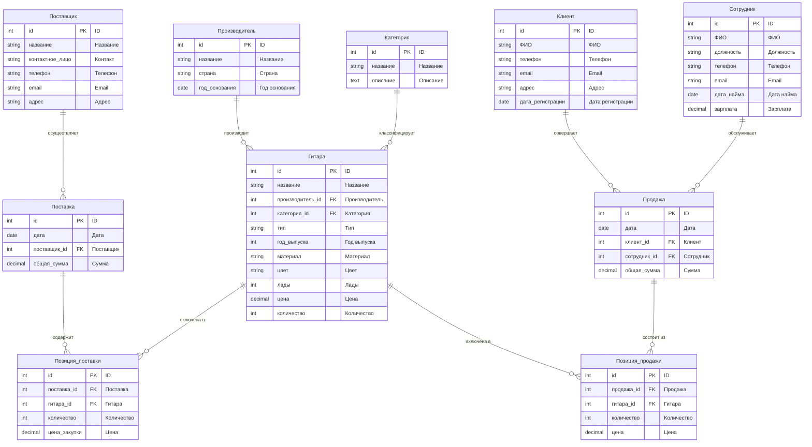

# ER-диаграмма системы учёта гитар

## Полная схема базы данных

## Условные обозначения
- **PK** - Первичный ключ
- **FK** - Внешний ключ
- **||--o{** - Один ко многим
- **o--o** - Многие ко многим
