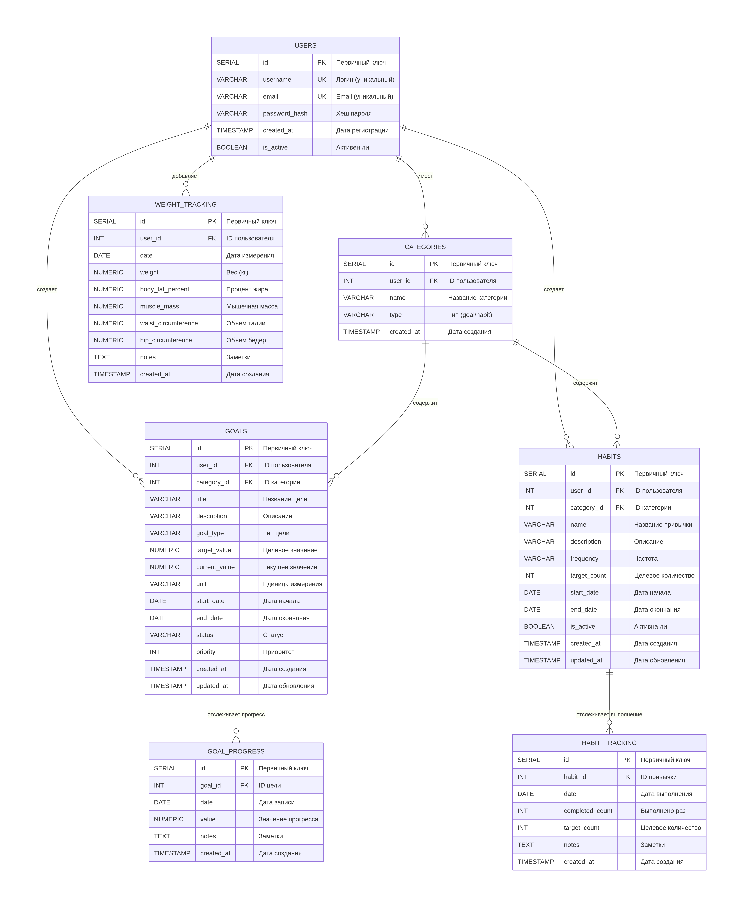

<p align="center">Министерство образования, науки и молодежной политики Республики Коми</p>

<p align="center">ГПОУ "Сыктывкарский политехнический техникум"</p>


<p align="center">Курсовая работа</p>


<p align="center">тема:БД для учета личных привычек сотрудников </p>


<p align="right"> выполнил </p>

<p align="right">студент 4 курса </p>

<p align="right">414 группы </p>

<p align="right">Тебеньков Матвей Сергеевич</p>


<p align="right">проверил</p>

<p align="right">Пунгин И.В.</p>

<p align="right">дата проверки: </p>


<p align="center">Сыктывкар, 2025</p>

# Задание на курсовую работу по МДК 11.01 "Технология разработки и защиты баз данных"

Специальность: <ins> 09.02.07 "Информационные системы и программирование"  </ins>

Тема курсовой работы:База данных для трекинга целей и привычек

Срок представления работы к защите: <ins> 19 декабря 2025 года. </ins>

Перечень подлежащих разработке вопросов:


## <a id="content">Содержание</a>

1. [Введение](#introduction)
    - [Цель работы](#target)
    - [Задачи работы](#tasks)
2. [Основная часть](#main)
    - [Анализ предметной области. Постановка задачи](#analysis)
    - [Инфологическая (концептуальная) модель базы данных](#infological_model)
    - [Логическая структура БД](#logical_structure)
    - [Физическая структура базы данных](#physical_structure)
    - [Реализация проекта в среде конкретной СУБД](#project_realization)
3. [Заключение](#conclusion)
4. [Список использованных информационных источников](#literature)
5. [Приложения](#applications)


   
## <a id="introduction">Введение</a>
В современном мире, характеризующемся высоким темпом жизни и обилием информации, осознанное саморазвитие и формирование устойчивых позитивных привычек становятся ключевыми факторами личной эффективности и благополучия. Однако процесс постановки целей, отслеживания прогресса и выработки новых поведенческих паттернов зачастую носит стихийный и несистемный характер, что приводит к потере мотивации и низкой результативности. В этой связи актуальной задачей является разработка инструментов, позволяющих структурировать и автоматизировать персональный рост, что обуславливает необходимость создания специализированной базы данных (БД) для трекинга привычек и целей.

Основная задача настоящей курсовой работы заключается в проектировании и реализации интуитивно понятной, функциональной базы данных, которая предоставит пользователю возможности для гибкого конфигурирования целей, привычек, ввода и редактирования результатов. Система должна обеспечивать корректную обработку запросов различной сложности, поддерживать целостность и непротиворечивость данных, а также гарантировать безопасность персональной информации за счет надежной аутентификации и разграничения прав доступа.


 #### <a id="target">Цель работы</a>

Целью данной курсовой работы является разработка базы данных для трекинга целей и привычек,которая позволит гибко конфигурировать цели и привычки , а также ввод,отслеживание и редактирование результата.


 ### <a id="tasks"> Задачи работы </a>
 
ЗАДАЧИ РАБОТЫ

####  1. Анализ предметной области и проектирование архитектуры системы
1.1. Провести исследование процессов личного целеполагания и формирования привычек, выделить ключевые сущности, атрибуты и пользовательские сценарии для определения функциональных требований к системе.

1.2. Изучить методологии управления целями (SMART, OKR) и принципы работы современных трекеров привычек для проектирования структуры данных и ключевых бизнес-процессов системы.

####  2. Проектирование и реализация базы данных в СУБД PostgreSQL
2.1. Разработать концептуальную модель в виде ER-диаграммы, отображающую сущности (Пользователь, Цель, Привычка, Прогресс, Категория) и связи между ними, в соответствии с требованиями предметной области.

2.2. Спроектировать логическую и физическую модели реляционной БД: преобразовать ER-диаграмму в схему таблиц, определить типы данных, первичные и внешние ключи, ограничения целостности, а также стратегии индексирования для оптимизации запросов на выборку и агрегацию данных.

2.3. Реализовать DDL-скрипты для создания всех объектов базы данных. Разработать набор хранимых процедур и триггеров для автоматизации расчета прогресса по целям, обработки повторяющихся привычек и обеспечения корректности данных.

#### 3. Разработка веб-интерфейса для взаимодействия с базой данных
3.1. Спроектировать и реализовать веб-сайт, предоставляющий пользователю интуитивно понятный интерфейс для полноценной работы с системой трекинга. Обеспечить основные функции: регистрацию и вход, создание и редактирование целей и привычек, фиксацию ежедневного прогресса, просмотр статистики и истории.

#### 4. Тестирование, наполнение данными и подготовка отчетности
4.1. Провести комплексное тестирование системы: функциональное тестирование бизнес-логики в БД (процедуры, триггеры), проверку корректности ключевых запросов, а также интеграционное тестирование взаимодействия веб-интерфейса с базой данных.

4.2. Подготовить демонстрационные данные и типовые сценарии использования, наглядно показывающие работу всех компонентов системы — от постановки цели в веб-интерфейсе до автоматического формирования отчетов на основе данных в БД.
 


1. Описание предметной области и функции решаемых задач
- Предметная область данной работы — персонализированный менеджмент личного развития и продуктивности. Система направлена на автоматизацию процессов постановки целей, формирования привычек и отслеживания прогресса. Основной целью является создание цифрового инструмента, который помогает пользователю структурировать свои устремления, повысить осознанность действий и дисциплину за счет систематической фиксации и анализа данных. Автоматизация позволяет упростить рутинное ведение записей, обеспечить надежное хранение личной истории изменений и повысить эффективность саморазвития за счет наглядной визуализации прогресса.
- Функции решаемых задач:
- Управление пользователями: Регистрация и аутентификация пользователей системы, обеспечение конфиденциальности и изоляции личных данных.
- Управление целями: Возможность создания, редактирования и архивации целей различных типов (числовые, булевые, привычковые) с установкой целевых значений, сроков, приоритетов и категорий.
- Управление привычками: Создание повторяющихся активностей (ежедневных, еженедельных, ежемесячных) с заданием целевой частоты выполнения, а также привязка напоминаний.
- Фиксация прогресса: Ежедневное или регулярное внесение данных о выполнении привычек и достижении промежуточных результатов по целям (например, текущий вес, количество прочитанных страниц).
- Категоризация и организация: Группировка целей и привычек по пользовательским категориям (например, «Здоровье», «Спорт», «Карьера») для упрощения навигации и анализа.
- Ведение расширенных метрик: Специализированный трекинг дополнительных параметров, таких как вес и антропометрические данные, для комплексного мониторинга прогресса в областях, связанных со здоровьем и фитнесом.
- Анализ и отчетность: Автоматический расчет статистики (процент выполнения, текущие стрики, динамика изменений), формирование отчетов и предоставление данных для визуализации в виде графиков и дашбордов.

2. Перечень входных данных
Для эффективной работы системы необходимы следующие входные данные:

**1.Данные о пользователях:**
- Идентификатор пользователя (ID).
- Имя пользователя (username) и электронная почта (email).
- Хэш пароля для аутентификации.
- Статус активности аккаунта.


2.Данные о целях:
- Идентификатор цели (ID) и пользователя-владельца.
- Название, описание и категория цели.
- Тип цели (numeric, boolean, habit).
- Целевое и текущее значение с единицами измерения.
- Даты начала и окончания, статус (active, completed, failed, paused).
- Уровень приоритета (от 1 до 5).
  
3.Данные о прогрессе по целям:
- Идентификатор записи (ID) и связанная цель.
- Дата фиксации прогресса.
- Значение прогресса и дополнительные заметки.

4.Данные о привычках:
- Идентификатор привычки (ID) и пользователя-владельца.
- Название, описание и категория привычки.
- Частота выполнения (daily, weekly, monthly).
- Целевое и фактическое количество выполнений за период.
- Даты начала и окончания действия, статус активности.

5.Данные об отслеживании привычек:
  
- Идентификатор записи (ID) и связанная привычка.
- Дата отслеживания.
- Запланированное и фактически выполненное количество раз.
- Заметки за день.
  
6.Данные о напоминаниях:
- Идентификатор напоминания (ID), пользователь и связанная привычка.
- Время срабатывания напоминания.
- Дни недели для повторения и статус активности.
  
7.Данные о категориях:
- Идентификатор категории (ID) и пользователь-владелец.
- Название категории и тип сущностей, для которых она применяется (goal, habit).


3. Перечень выходных данных
На основе входных данных система должна предоставить следующие выходные данные:
1.Персональный дашборд:
- Сводка по активным целям и привычкам с индикацией текущего прогресса.
- Календарь выполнения привычек («heatmap»).
- Графики динамики ключевых числовых метрик (вес, прогресс по целям) за выбранный период.
  
2.Детальная аналитика:
- Отчет об успешности выполнения привычек за неделю/месяц (процент выполненных дней, текущая серия).
- Детализированная история прогресса по конкретной цели.
- Статистика по категориям (распределение усилий, успешность).
  
3.Списки и журналы:
- Полный список целей и привычек с возможностью фильтрации по статусу, категории, приоритету.
- Журнал всех зафиксированных действий (трекинг привычек, записи прогресса, замеры веса) в хронологическом порядке.

4. Ограничения предметной области
При работе с системой могут возникнуть следующие ограничения:
- Ограничение по консистентности данных: Необходимо гарантировать, что данные, отображаемые в аналитике (например, текущее значение цели), всегда актуальны и пересчитываются при каждом новом вводе. Это требует тщательной проработки триггеров и процедур на уровне БД.
- Ограничение по производительности при росте данных: Накопление большого объема исторических данных (ежедневные трекеры за годы) может замедлить формирование агрегированных отчетов. Требуется применение оптимизационных стратегий: использование корректных индексов (как в предоставленной схеме), кэширование результатов через материализованные представления для сложной аналитики.
- Ограничение по логике бизнес-правил: Система должна корректно обрабатывать edge-кейсы, например, предотвращать создание нескольких записей трекинга для одной привычки за один день (реализовано через UNIQUE(habit_id, date)), валидировать вводимые значения (вес > 0, процент жира от 0 до 100).
- Ограничение по безопасности и приватности: Все данные строго привязаны к пользователю. Необходимо обеспечить, чтобы на уровне API и бизнес-логики приложения пользователь мог получать и изменять только свои собственные записи.

5. Взаимодействие с другими программами и компонентами
Система трекинга привычек и целей может быть расширена за счет взаимодействия с внешними сервисами и компонентами:
- Веб-интерфейс (Frontend): Разрабатываемый в рамках курсовой веб-сайт будет основным каналом взаимодействия пользователя с базой данных, предоставляя формы для ввода данных, интерфейсы для настройки и визуализируя аналитические отчеты.

  
#### <a id="infological_model">Инфологическая (концептуальная) модель базы данных</a>

Концептуальная модель базы данных описывает структуру данных, которая будет храниться и обрабатываться в базе, без привязки к конкретной системе управления базами данных (СУБД). В рамках этой модели выделяются ключевые информационные объекты (сущности), атрибуты этих объектов, связи между ними, а также мощности отношений, которые определяют тип связей между сущностями. Эта модель отражает предметную область трекинга личных привычек и целей.

1. Выделение информационных объектов

Пользователи — физические лица, использующие систему для личного трекинга.
Категории — пользовательские метки для группировки целей и привычек по темам.
Цели — конкретные, измеримые задачи, которые пользователь ставит перед собой.
Прогресс целей — история внесенных пользователем промежуточных результатов.
Привычки — регулярные, повторяющиеся действия, которые пользователь хочет закрепить.
Отслеживание привычек — ежедневная/регулярная фиксация выполнения привычек.

2. Определение атрибутов объектов
Каждая из выделенных сущностей имеет свои уникальные атрибуты, которые описывают их свойства.

**Пользователи:**

- user_id - Уникальный идентификатор пользователя.

- username - Имя пользователя для входа.

- email - Адрес электронной почты.

- password_hash - Хэшированный пароль для аутентификации.

- is_active - Статус активности аккаунта.

**Категории:**

- category - Уникальный идентификатор категории.

- user_id - Идентификатор пользователя-владельца.

- name - Название категории.

- type - Тип сущностей, для которых применяется категория (goal, habit).

**Цели:**

- goal_id - Уникальный идентификатор цели.

- user_id - Идентификатор пользователя-владельца.

- title - Название цели.

-description - Детальное описание.

- category - Категория, к которой относится цель.

- goal_type - Тип цели: numeric (числовая), boolean (да/нет), habit (привычковая).

- target_value - Целевое значение.

- current_value - Текущее значение прогресса.

- unit - Единица измерения.

- start_date, end_date - Планируемые даты начала и завершения.

- status - Текущий статус (active, completed, failed, paused).

- priority - Уровень приоритета (от 1 до 5).

**Прогресс целей:**

- progress_id - Уникальный идентификатор записи о прогрессе.

- goal_id - Идентификатор связанной цели.

- date - Дата фиксации прогресса.

- value - Значение прогресса на эту дату.

- notes - Дополнительные заметки.

**Привычки:**

- habit_id - Уникальный идентификатор привычки.

- user_id - Идентификатор пользователя-владельца.

- name - Название привычки.

- description - Детальное описание.

- category - Категория привычки.

- frequency - Частота выполнения (daily, weekly, monthly).

- target_count - Целевое количество выполнений за период.

- start_date, end_date - Даты начала и окончания действия.

- is_active - Флаг активности привычки.

**Отслеживание привычек:**

- tracking_id - Уникальный идентификатор записи трекинга.

- habit_id - Идентификатор связанной привычки.

- date - Дата отслеживания.

- completed_count - Фактически выполненное количество раз.

- target_count - Плановое количество выполнений.

- notes - Заметки за день.


3. Определение отношений и мощности отношений между объектами
В данной базе данных для трекинга привычек и целей выделены следующие ключевые связи:

**Пользователь - (Цели, Привычки, Категории):**

Связь: Один ко многим (1:M).

Описание: Один пользователь может создать множество целей, привычек, категорий и записей трекинга веса. Каждая из этих сущностей принадлежит только одному пользователю, что обеспечивает полную изоляцию данных.

**Пользователь - Категории:**

Связь: Один ко многим (1:M).

Описание: Пользователь создает собственные категории для организации своих целей и привычек. Одна категория принадлежит только одному пользователю.

**Цель - Прогресс целей:**

Связь: Один ко многим (1:M).

Описание: Для каждой цели пользователь может регулярно фиксировать промежуточные результаты. Одна запись прогресса относится строго к одной конкретной цели.

**Привычка - Отслеживание привычек:**

Связь: Один ко многим (1:M).

Описание: Результаты выполнения привычки фиксируются ежедневно или в соответствии с её периодичностью. Множество записей трекинга накапливаются для каждой привычки, формируя историю выполнения.

**Категории - (Цели, Привычки):**

Связь: Один ко многим (1:M).

Описание: Каждая категория может содержать множество целей или привычек (в зависимости от типа категории). Одна цель или привычка может быть отнесена только к одной категории, что позволяет пользователю структурировать свои задачи.


#### <a id="logical-structure"> Логическая структура базы данных </a>

Логическая структура базы данных представляет собой реализацию концептуальной модели в терминах реляционной модели данных. На данном этапе происходит преобразование сущностей и отношений ER-диаграммы в схему таблиц с конкретными типами данных, ограничениями целостности и определением связей между таблицами.

1. Принципы преобразования ER-модели в реляционную схему

Преобразование концептуальной модели в логическую структуру осуществлялось по следующим правилам:

Сущности → Таблицы — каждая сущность ER-диаграммы преобразуется в отдельную таблицу.

Атрибуты → Столбцы — атрибуты сущностей становятся столбцами соответствующих таблиц.

Первичные ключи — для каждой таблицы определяется первичный ключ для уникальной идентификации записей.

Внешние ключи — отношения между сущностями реализуются через механизм внешних ключей (например, связь целей с пользователями).

Ограничения целостности — добавляются CHECK-ограничения для обеспечения бизнес-правил (валидация оценок, диапазонов дат, типов данных).

Оптимизация производительности — на этапе проектирования определены ключевые индексы для ускорения частых запросов.

2. Список таблиц базы данных

Логическая схема базы данных системы трекинга привычек и целей включает следующие таблицы:

№	Таблица	Назначение	Примерное количество записей

1	users	Хранение информации о зарегистрированных пользователях системы	1,000

2	categories	Пользовательские категории для группировки целей и привычек	2,000

3	goals	Основные цели пользователей с метаданными и статусами	5,000

4	goal_progress	История промежуточных результатов по целям	100,000

5	habits	Определения привычек (шаблоны регулярных действий)	10,000

6	habit_tracking	Фактическое ежедневное/регулярное выполнение привычек	1,000,000


3. Логическая структура базы данных№

Логическая структура БД соответствует третьей нормальной форме (3NF), что обеспечивает:

Отсутствие транзитивных зависимостей — все неключевые атрибуты зависят только от первичного ключа.

Устранение избыточности данных — каждая сущность хранится только в одной таблице.

Целостность данных — использование внешних ключей гарантирует согласованность данных.

Пример нормализации:

Информация о пользователе хранится только в таблице users.

В таблицах goals и habits хранятся только ссылки на пользователя (user_id).

История прогресса выделена в отдельные таблицы goal_progress и habit_tracking, что позволяет эффективно хранить временные ряды данных.

Это предотвращает дублирование данных о пользователе для каждой цели и привычки, а также оптимизирует хранение исторических записей.

4. Обеспечение целостности данных

Логическая структура включает следующие механизмы обеспечения целостности:

Первичные ключи — гарантируют уникальность каждой записи (user_id, goal_id, habit_id и т.д.).

Внешние ключи — обеспечивают ссылочную целостность между таблицами (например, все goal_id в goal_progress существуют в таблице goals).

CHECK-ограничения — проверяют значения на соответствие бизнес-правилам (вес > 0, приоритет 1-5, процент жира 0-100).

UNIQUE-ограничения — предотвращают дублирование уникальных значений (комбинация habit_id + date в habit_tracking).

NOT NULL — обеспечивают обязательность заполнения критических полей (название цели, дата начала, email пользователя).

ENUM/CHECK для типов — ограничивают допустимые значения статусов, типов целей и частот привычек.

5. Преимущества разработанной логической структуры

Гибкость — позволяет легко добавлять новые типы целей, привычек и категории.

Масштабируемость — структура поддерживает рост пользователей до 1,000 и хранение миллионов записей о прогрессе.

Производительность — оптимальное распределение данных по таблицам с учетом частоты запросов. Наиболее часто запрашиваемые данные (активные цели, текущие привычки) отделены от исторических архивов.

Аналитические возможности — отдельное хранение прогресса позволяет эффективно строить временные ряды и анализировать динамику.

Безопасность — изоляция данных по пользователям на уровне структуры БД (все таблицы содержат user_id).

Удобство для разработки API — четкая структура таблиц соответствует объектной модели предметной области, что упрощает создание RESTful API.


## <a id="physical_structure">Физическая структура базы данных</a>



Физическая структура базы данных отвечает за реальное хранение данных на физическом уровне, определяет способы хранения и работы с данными, обеспечивая при этом их целостность, доступность и производительность системы. На этом этапе важно учитывать оптимизацию производительности запросов, объёмы данных и ограничения, связанные с физическим хранением данных в выбранной СУБД. В данной курсовой работе предполагается использование реляционной СУБД PostgreSQL, так как она предоставляет оптимальные средства для управления табличными данными и поддерживает сложные связи между данными, что необходимо для системы трекинга привычек и целей, включающей временные ряды и аналитические запросы.

Физическая структура проектируется таким образом, чтобы система максимально эффективно обрабатывала данные, предоставляя пользователю доступ к нужной информации с минимальной задержкой. Это достигается с помощью выбора правильных типов данных, создания оптимальных индексов, реализации механизмов хранения и настройки параметров, обеспечивающих производительность и надежность.

## <a id="implementation"> Реализация проекта в среде конкретной СУБД. </a>

Описание разработки таблиц в конкретной среде СУБД

Разработка таблиц осуществлялась в среде PostgreSQL 14+ с использованием SQL-скриптов, выполняемых через утилиту командной строки psql. Все таблицы созданы с учетом нормализации до 3NF, с явным указанием типов данных, ограничений целостности и связей между таблицами.


Таблица пользователей
```sql
CREATE TABLE users (
    id SERIAL PRIMARY KEY,
    username VARCHAR(50) UNIQUE NOT NULL,
    email VARCHAR(100) UNIQUE NOT NULL,
    password_hash VARCHAR(255) NOT NULL,
    created_at TIMESTAMP DEFAULT CURRENT_TIMESTAMP,
    is_active BOOLEAN DEFAULT TRUE
);
```

-- Таблица категорий
```sql
CREATE TABLE categories (
    id SERIAL PRIMARY KEY,
    user_id INTEGER NOT NULL REFERENCES users(id) ON DELETE CASCADE,
    name VARCHAR(50) NOT NULL,
    type VARCHAR(20) NOT NULL CHECK (type IN ('goal', 'habit')),
    created_at TIMESTAMP DEFAULT CURRENT_TIMESTAMP,
    CONSTRAINT unique_user_category UNIQUE (user_id, name, type)
);
```

-- Таблица целей
```sql
CREATE TABLE goals (
    id SERIAL PRIMARY KEY,
    user_id INTEGER NOT NULL REFERENCES users(id) ON DELETE CASCADE,
    title VARCHAR(200) NOT NULL,
    description TEXT,
    category VARCHAR(50),
    goal_type VARCHAR(20) CHECK (goal_type IN ('numeric', 'boolean', 'habit')),
    target_value NUMERIC(10,2),
    current_value NUMERIC(10,2) DEFAULT 0,
    unit VARCHAR(20),
    start_date DATE NOT NULL,
    end_date DATE,
    status VARCHAR(20) DEFAULT 'active' 
        CHECK (status IN ('active', 'completed', 'failed', 'paused')),
    priority INTEGER CHECK (priority >= 1 AND priority <= 5),
    created_at TIMESTAMP DEFAULT CURRENT_TIMESTAMP,
    updated_at TIMESTAMP DEFAULT CURRENT_TIMESTAMP
);
```

-- Таблица прогресса целей
```sql
CREATE TABLE goal_progress (
    id SERIAL PRIMARY KEY,
    goal_id INTEGER NOT NULL REFERENCES goals(id) ON DELETE CASCADE,
    date DATE NOT NULL,
    value NUMERIC(10,2) NOT NULL,
    notes TEXT,
    created_at TIMESTAMP DEFAULT CURRENT_TIMESTAMP,
    CONSTRAINT unique_goal_date UNIQUE (goal_id, date)
);
```

-- Таблица привычек
```sql
CREATE TABLE habits (
    id SERIAL PRIMARY KEY,
    user_id INTEGER NOT NULL REFERENCES users(id) ON DELETE CASCADE,
    name VARCHAR(100) NOT NULL,
    description TEXT,
    category VARCHAR(50),
    frequency VARCHAR(20) NOT NULL CHECK (frequency IN ('daily', 'weekly', 'monthly')),
    target_count INTEGER DEFAULT 1,
    start_date DATE NOT NULL,
    end_date DATE,
    is_active BOOLEAN DEFAULT TRUE,
    created_at TIMESTAMP DEFAULT CURRENT_TIMESTAMP
);
```


-- Таблица отслеживания привычек
```sql
CREATE TABLE habit_tracking (
    id SERIAL PRIMARY KEY,
    habit_id INTEGER NOT NULL REFERENCES habits(id) ON DELETE CASCADE,
    date DATE NOT NULL,
    completed_count INTEGER DEFAULT 0,
    target_count INTEGER NOT NULL,
    notes TEXT,
    created_at TIMESTAMP DEFAULT CURRENT_TIMESTAMP,
    CONSTRAINT unique_habit_date UNIQUE (habit_id, date)
);
```


```sql
ALTER TABLE users ENABLE ROW LEVEL SECURITY;
ALTER TABLE categories ENABLE ROW LEVEL SECURITY;
ALTER TABLE goals ENABLE ROW LEVEL SECURITY;
ALTER TABLE goal_progress ENABLE ROW LEVEL SECURITY;
ALTER TABLE habits ENABLE ROW LEVEL SECURITY;
ALTER TABLE habit_tracking ENABLE ROW LEVEL SECURITY;
```

-- Только администраторы могут видеть всех пользователей
-- Пользователи видят только свои данные
--Так для всех таблиц
```sql
CREATE POLICY users_select_policy ON users
    FOR SELECT
    USING (
        id = current_setting('app.current_user_id', TRUE)::INTEGER 
        OR current_setting('app.user_role', TRUE) = 'postgres'
    );
```

    
Получение всех активных пользователей
```sql
SELECT id, username, email, created_at 
FROM users 
WHERE is_active = TRUE 
ORDER BY created_at DESC;
```


Получение всех целей одного пользователя
```sql
SELECT title, description, status, current_value, target_value, unit, end_date
FROM goals 
WHERE user_id = 1 
ORDER BY priority DESC, end_date;
```

Получение активных привычек пользователя
```sql
SELECT name, description, frequency, target_count, start_date
FROM habits 
WHERE user_id = 1 AND is_active = TRUE;
```


Регистрация нового пользователя
```sql
INSERT INTO users (username, email, password_hash) 
VALUES ('new_user', 'user@example.com', 'hashed_password_123');
```

Создание новой цели
```sql
INSERT INTO goals (user_id, title, goal_type, target_value, unit, start_date, priority) 
VALUES (1, 'Пробежать 10 км', 'numeric', 10, 'км', '2024-02-01', 3);
```

Создание новой привычки
```sql
INSERT INTO habits (user_id, name, frequency, target_count, start_date) 
VALUES (1, 'Читать книгу', 'daily', 1, '2024-02-01');
```

Фиксация выполнения привычки на сегодня
```sql
INSERT INTO habit_tracking (habit_id, date, completed_count, target_count) 
VALUES (1, CURRENT_DATE, 1, 1);
```


## <a id="end"> **Заключение** </a>
В рамках выполнения курсового проекта была успешно разработана и реализована информационная система управления целями и привычками с использованием современных технологий и подходов к программированию.

## <a id="literature"> **Список литературы** </a>

Основная литература
Дейтел, П. Дж., Дейтел, Х. М. PHP и MySQL. Разработка веб-приложений. — 5-е изд. — СПб.: Питер, 2021.
Содержит полное руководство по разработке веб-приложений с использованием PHP и баз данных.

Дакетт, Дж. HTML и CSS. Разработка и дизайн веб-сайтов. — М.: Эксмо, 2020. — 480 с.
*Классическое руководство по основам веб-разработки, включая HTML5 и CSS3.*

Петин, В. А. Разработка веб-приложений с помощью PHP и MySQL. — 4-е изд. — СПб.: БХВ-Петербург, 2022.
Практическое руководство с примерами создания полного веб-приложения.

Карпова, Т. С. Базы данных: модели, разработка, реализация. — 2-е изд. — СПб.: Питер, 2021. 
Теоретические основы проектирования и реализации баз данных.

Официальная документация
PostgreSQL Global Development Group. PostgreSQL 14 Documentation [Электронный ресурс]. — Режим доступа: https://www.postgresql.org/docs/14/index.html
Официальная документация по СУБД PostgreSQL.

PHP Documentation Group. PHP Manual [Электронный ресурс]. — Режим доступа: https://www.php.net/manual/ru/
Официальная документация по языку PHP.

World Wide Web Consortium (W3C). HTML Living Standard [Электронный ресурс]. — Режим доступа: https://html.spec.whatwg.org/
Спецификация стандарта HTML.


